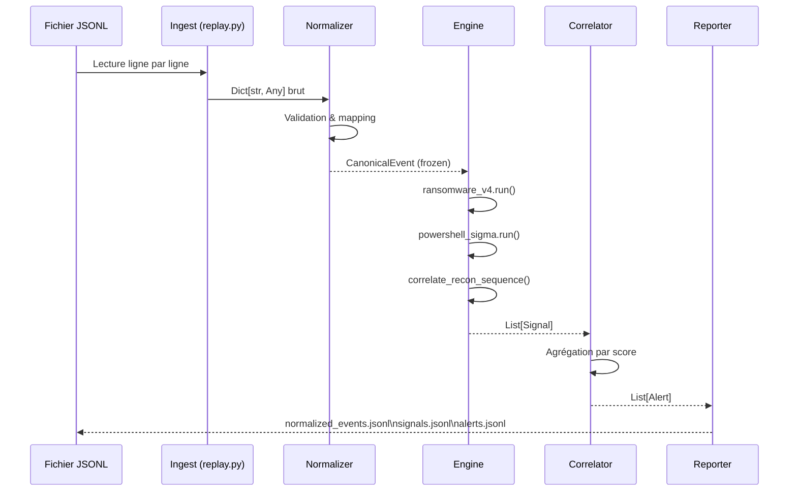

# Vue d'ensemble de l'architecture

## Principes de conception

Mini-SIEM v1 repose sur quatre principes architecturaux non négociables :

**1. Immuabilité des données normalisées**  
Tout événement, une fois normalisé en `CanonicalEvent`, est `frozen=True`. Aucun module de détection ne peut le modifier. Cette contrainte élimine une classe entière de bugs — la mutation accidentelle d'un événement par un détecteur qui corromprait les résultats d'un autre.

**2. Déterminisme des identifiants**  
`stable_event_id()` produit un SHA-256 du contenu brut. Le même événement en entrée produit toujours le même `event_id`. Cela rend les pipelines rejouables et les résultats comparables entre exécutions.

**3. Isolation des modules**  
Chaque module de détection reçoit la liste complète des événements normalisés et retourne une liste de `Signal`. Une exception dans un module n'en bloque pas d'autres.

**4. Séparation Signals / Alerts**  
Les modules de détection ne produisent jamais d'`Alert` directement. Les Alerts sont le produit exclusif du corrélateur, qui agrège et contextualise les Signals. Cette séparation permet de changer la politique de corrélation sans toucher aux détecteurs.

## Flux de données



## Couches logiques

### Couche 1 — Ingestion

`replay.py` lit un fichier `.jsonl` ligne par ligne. Chaque ligne est parsée en `Dict[str, Any]`. Aucune validation n'est effectuée à ce stade — c'est délibéré : la normalisation s'en charge.

### Couche 2 — Normalisation

`normalizer.py` convertit chaque dict brut en `CanonicalEvent` via un mapping explicite de champs. Les champs absents produisent des valeurs `None`, jamais d'erreur. L'`event_type` est normalisé à l'un des cinq types : `process`, `file`, `network`, `auth`, `other`.

### Couche 3 — Détection

`engine.py` orchestre deux modules séquentiellement :

```python
signals.extend(ransomware_v4.run(events))       # couche comportementale
ps_signals = powershell_sigma.run(events, ...)  # couche signature
signals.extend(ps_signals)
correlated = powershell_sigma.correlate_recon_sequence(events, ps_signals)
signals.extend(correlated)                       # couche corrélation
```

### Couche 4 — Corrélation

`correlator.py` applique une politique simple : tout Signal de type `ransomware_behavior` avec `score >= 0.3` génère une Alert. La sévérité est calculée par seuils déterministes.

### Couche 5 — Export

`reporter.py` écrit trois fichiers JSONL fixes plus un fichier de timeline par alerte.

## Modèle de types

```
Dict[str, Any]          (brut, mutable, non validé)
       ↓  normalize()
CanonicalEvent          (frozen, typé, structuré)
       ↓  run_all()
List[Signal]            (frozen, score 0..1, pointeurs event_ids)
       ↓  correlate()
List[Alert]             (frozen, sévérité calculée, actions suggérées)
```

## Limitations v1

!!! warning "Limitations connues"
    - **Source unique** : seul le format JSONL maison est supporté. Pas de syslog, CEF, Winlogbeat.
    - **Pas de process tree** : les relations parent-enfant ne sont pas modélisées. Les règles "spawn suspect" (ex : `winword.exe → powershell.exe`) sont impossibles.
    - **Pas de baseline** : l'absence de contexte historique produit des faux positifs sur les activités admin légitimes.
    - **Corrélation basique** : un seul type de chaîne temporelle (recon PowerShell) est détecté.
    - **Pas de MITRE tagging** : les Signals ne portent pas de tactique/technique ATT&CK.
