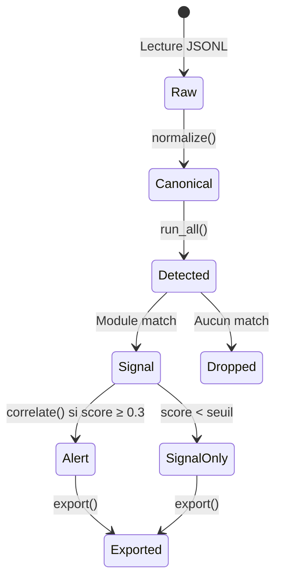

# Pipeline de données

## Cycle de vie d'un événement

Chaque événement brut traverse cinq étapes avant de contribuer (ou non) à une alerte.



## Format d'entrée (JSONL v1)

Chaque ligne du fichier d'entrée est un objet JSON indépendant. Les champs reconnus par le normalizer :

```json
{
  "timestamp":       "2024-01-15T12:00:00Z",   // ISO 8601 ou epoch
  "host":            "WIN-SRV01",
  "event_type":      "process",                // process|file|network|auth|other
  "source":          "sysmon_like",
  "process_name":    "powershell.exe",
  "pid":             4288,
  "ppid":            1234,
  "process_path":    "C:\\Windows\\System32\\WindowsPowerShell\\v1.0\\powershell.exe",
  "command_line":    "powershell -enc SGVsbG8=",
  "integrity_level": "High",
  "username":        "CORP\\jdoe",
  "domain":          "CORP",
  "sid":             "S-1-5-21-...",
  "file_path":       "C:\\Users\\jdoe\\doc.docx.encrypted",
  "operation":       "write",
  "dest_ip":         "192.168.1.50",
  "dest_port":       445,
  "protocol":        "tcp"
}
```

!!! note "Champs optionnels"
    Tous les champs sont optionnels sauf `timestamp`. Un champ absent produit `None` dans le `CanonicalEvent`, jamais une erreur de parsing.

## Normalisation — Règles de mapping

| Champ brut | Champ canonique | Notes |
|---|---|---|
| `timestamp` | `event_time_utc` | Parsé via `parse_to_utc()`, fallback sur l'heure d'ingestion |
| `host` | `host.hostname` | Fallback `--default-host` (CLI) |
| `event_type` | `event_type` | Restreint à l'énumération des 5 types |
| `process_name` | `process.name` | |
| `pid` | `process.pid` | int ou None |
| `ppid` | `process.ppid` | int ou None |
| `process_path` | `process.image_path` | |
| `command_line` | `process.command_line` | |
| `integrity_level` | `process.integrity_level` | |
| `username` | `user.username` | |
| `domain` | `user.domain` | |
| `sid` | `user.sid` | |
| `file_path` | `file.path` + `file.extension` + `file.directory` | Extraction automatique |
| `operation` | `file.operation` | write/modify/rename/delete/create/open |
| `dest_ip` | `network.dest_ip` | |
| `dest_port` | `network.dest_port` | |
| `protocol` | `network.protocol` | |

## Calcul de l'event_id

```python
blob = json.dumps(raw_event, sort_keys=True, separators=(",", ":")).encode("utf-8")
h = hashlib.sha256(b"v1|" + blob).hexdigest()
```

**Propriétés garanties :**

- Déterministe : même entrée → même ID
- Collision-résistant : SHA-256, 256 bits d'entropie
- Replayable : un pipeline peut être relancé sans créer de doublons fantômes

## Format de sortie

### signals.jsonl

```json
{
  "signal_id":         "rw_powershell.exe|4288|...",
  "signal_type":       "ransomware_behavior",
  "host":              {"hostname": "WIN-SRV01"},
  "process_key":       "powershell.exe|4288|c:/windows/system32/...",
  "user_key":          "jdoe",
  "score":             0.87,
  "confidence":        0.87,
  "risk_factors":      ["mass_file_write", "extension_rename", "vss_deletion"],
  "evidence_event_ids":["abc123...", "def456..."],
  "explanation":       "Process powershell.exe (PID 4288): ...",
  "recommended_actions": ["Isoler la machine", "Lancer une analyse mémoire"]
}
```

### alerts.jsonl

```json
{
  "alert_id":          "ALERT_rw_powershell.exe|4288|...",
  "title":             "Possible ransomware activity (critical)",
  "severity":          "critical",
  "confidence":        0.87,
  "host":              {"hostname": "WIN-SRV01"},
  "process_key":       "powershell.exe|4288|...",
  "summary":           "Ransomware heuristic score=0.87 confidence=0.87",
  "reasoning":         ["Risk factor matched: mass_file_write", "..."],
  "timeline_event_ids":["abc123..."],
  "suggested_actions": ["Isoler la machine"],
  "related_signals":   ["rw_powershell.exe|4288|..."]
}
```
