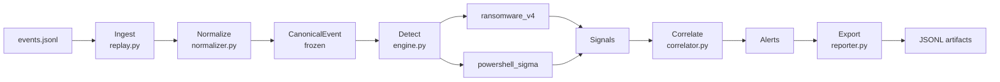

# Mini-SIEM v1 — Documentation

<div style="background: linear-gradient(135deg, #1a1a2e 0%, #16213e 50%, #0f3460 100%); padding: 2rem; border-radius: 12px; margin-bottom: 2rem;">
<h2 style="color: #e94560; margin: 0 0 0.5rem 0;">🛡️ Mini-SIEM v1</h2>
<p style="color: #a8b2d8; margin: 0;">Moteur de détection comportementale orienté ransomware & PowerShell suspect</p>
</div>

## Présentation

Mini-SIEM v1 est un pipeline Python de détection locale d'événements de sécurité Windows. Il ingère des événements au format JSONL, les normalise dans un schéma canonique immuable, et produit des **Signals** puis des **Alerts** via trois modules de détection.

!!! info "Version"
    Cette documentation couvre la **v1 (version initiale)**. Pour la v2 avec support syslog, process tree et règles LOTL, consultez la [documentation v2](../siem-v2).

## Périmètre de détection

| Catégorie | Module | Description |
|-----------|--------|-------------|
| Ransomware | `ransomware_v4` | Écriture massive, renommage d'extensions, suppression VSS, C2 |
| PowerShell | `powershell_sigma` | Obfuscation, download cradles, AMSI bypass, encodage base64 |
| Corrélation temporelle | `powershell_sigma.correlate_recon_sequence` | Chaîne recon → exec sur fenêtre temporelle |

## Architecture en un coup d'œil



## Structure du projet

```
SIEM/
├── events.jsonl              # Jeu de test small
├── events_large.jsonl        # Jeu de test large
├── run_siem.bat              # Lanceur Windows
├── src/
│   ├── core/
│   │   ├── schemas.py        # CanonicalEvent, Signal, Alert (dataclasses frozen)
│   │   ├── ids.py            # stable_event_id (SHA-256 déterministe)
│   │   └── time.py           # parse_to_utc, utcnow
│   ├── normalize/
│   │   └── normalizer.py     # Dict[str,Any] → CanonicalEvent
│   ├── detect/
│   │   ├── engine.py         # Orchestrateur run_all()
│   │   └── modules/
│   │       ├── ransomware_core.py     # Logique de détection
│   │       ├── ransomware_v4.py       # Adaptateur CanonicalEvent
│   │       ├── powershell_sigma.py    # Parser YAML Sigma + détecteurs
│   │       └── powershell_suspicious.yaml
│   ├── correlate/
│   │   └── correlator.py     # Signals → Alerts
│   ├── ingest/
│   │   └── replay.py         # Point d'entrée CLI
│   └── output/
│       └── reporter.py       # Export JSONL
```

## Lancement rapide

```bash
# Petit jeu de données
run_siem.bat small

# Grand jeu de données
run_siem.bat large

# En Python direct
cd SIEM
set PYTHONPATH=src
python -m ingest.replay --input events.jsonl --out-dir out/
```

## Artefacts produits

Après exécution, le répertoire `out/` contient :

| Fichier | Contenu |
|---------|---------|
| `normalized_events.jsonl` | Tous les événements normalisés |
| `signals.jsonl` | Signaux bruts de détection |
| `alerts.jsonl` | Alertes corrélées avec sévérité |
| `timeline_ALERT_*.jsonl` | Chronologie détaillée par alerte |
