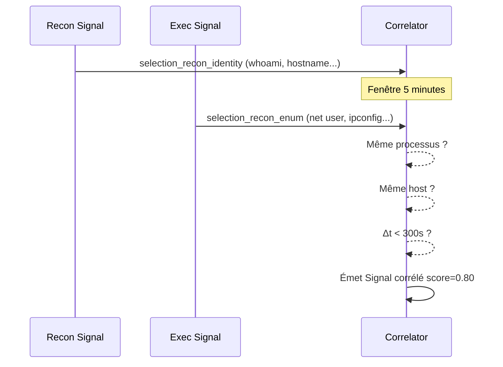

# Détection PowerShell (Sigma)

Module : `powershell_sigma.py` + `powershell_suspicious.yaml`

## Vue d'ensemble

Ce module implémente un moteur Sigma minimaliste en Python pur (sans dépendance `pySigma`) pour détecter des patterns suspects dans les événements PowerShell, notamment les EventID 4104 (Script Block Logging).

## Architecture du module

```
powershell_sigma.py
├── SimpleSigmaRule         ← Dataclass immuable (parsed rule)
├── _parse_simple_sigma_yaml()  ← Parser YAML maison (state machine)
├── _match_event()          ← Évaluation d'une règle sur un événement
├── run()                   ← Point d'entrée : events → List[Signal]
└── correlate_recon_sequence()  ← Corrélation temporelle recon → exec
```

## Parser Sigma maison

Le parser implémente un sous-ensemble du format Sigma YAML :

### Contraintes du parser (invariants)

1. Indentation **exactement 4/8/12 espaces** (pas de tabs)
2. Le bloc `detection:` doit être présent
3. Les blocs de sélection commencent par `selection`
4. Un seul modificateur supporté : `|contains`
5. Un seul champ par bloc de sélection

```yaml
# Format YAML supporté
title: PowerShell Suspicious Download Cradle
status: experimental
level: high
detection:
    selection_download:
        CommandLine|contains:
            - 'Invoke-WebRequest'
            - 'DownloadString'
            - 'DownloadFile'
    selection_iex:
        CommandLine|contains:
            - 'IEX'
            - 'Invoke-Expression'
    condition: selection_download or selection_iex
```

!!! warning "Limitations du parser"
    Le champ `condition` n'est pas évalué — toutes les selections sont traitées indépendamment avec une logique OR implicite. Un bloc avec deux champs ne retient que le dernier. Ces contraintes sont documentées en commentaire dans le code.

## Détecteurs inline (sans YAML)

Cinq détecteurs codés en dur dans `powershell_sigma.py` :

### 1. Obfuscation (score 0.70)

Détecte les patterns d'obfuscation PowerShell courants :

```python
OBFUSCATION_PATTERNS = [
    r"`[a-zA-Z]",           # backtick escape: `I`E`X
    r"\$\{[^}]+\}",        # variable brace notation: ${env:ComSpec}
    r"''\s*\+\s*''",        # string concat: 'Inv'+'oke'
    r"-join\s*\(",          # join array: ('I','E','X') -join ''
    r"\[char\]\s*\d+",      # char cast: [char]73
]
```

### 2. Download Cradles (score 0.75)

```python
DOWNLOAD_PATTERNS = [
    r"Net\.WebClient",
    r"Invoke-WebRequest",
    r"DownloadString",
    r"DownloadFile",
    r"Start-BitsTransfer",
    r"Invoke-RestMethod",
]
```

### 3. AMSI Bypass (score 0.85)

```python
AMSI_PATTERNS = [
    r"amsiInitFailed",
    r"AmsiScanBuffer",
    r"\[Ref\]\.Assembly\.GetType.*amsi",
    r"amsi\.dll.*VirtualProtect",
]
```

### 4. Encoded Commands (score 0.65)

Détecte les paramètres `-EncodedCommand` (ou abbréviations) avec une charge base64 :

```python
r"-[Ee]nc(odedCommand)?\s+[A-Za-z0-9+/=]{20,}"
```

Le seuil de 20 caractères base64 évite les faux positifs sur des arguments courts.

### 5. Nested Scripts (score 0.60)

```python
r"powershell.*powershell"   # PowerShell appelant PowerShell
r"cmd.*powershell"          # cmd.exe spawning PowerShell inline
```

## Corrélation temporelle — `correlate_recon_sequence()`

Cette fonction détecte la chaîne **reconnaissance → exécution** en deux étapes :



**Paramètres de la fenêtre :**
```python
RECON_WINDOW_SECONDS = 300  # 5 minutes
```

**Critères de corrélation :**
- Le signal de recon (`selection_recon_identity`) et le signal d'enum (`selection_recon_enum`) viennent du même `process_key`
- L'intervalle entre les deux est inférieur à 300 secondes

## Règles dans powershell_suspicious.yaml

```yaml
title: PowerShell Suspicious Command Usage
status: experimental
level: high
detection:
    selection_execution:
        CommandLine|contains:
            - 'IEX'
            - 'Invoke-Expression'
            - '-EncodedCommand'
            - '-Exec Bypass'
            - 'Bypass'
    selection_download:
        CommandLine|contains:
            - 'Invoke-WebRequest'
            - 'DownloadString'
            - 'DownloadFile'
            - 'WebClient'
    selection_recon_identity:
        CommandLine|contains:
            - 'whoami'
            - 'hostname'
            - 'Get-LocalUser'
    selection_recon_enum:
        CommandLine|contains:
            - 'net user'
            - 'net group'
            - 'ipconfig'
            - 'systeminfo'
            - 'Get-Process'
            - 'tasklist'
    condition: any of selection_*
```

## Exemple de Signal produit

```json
{
  "signal_id": "ps_amsi_bypass_abc123",
  "signal_type": "ps.amsi_bypass",
  "score": 0.85,
  "confidence": 0.85,
  "risk_factors": ["amsi_bypass", "process:powershell.exe"],
  "explanation": "[AMSI Bypass] amsiInitFailed detected in ScriptBlock on WIN-SRV01 by jdoe",
  "recommended_actions": [
    "Capturer le script block complet (EventID 4104)",
    "Analyser le script PowerShell obfusqué",
    "Vérifier les processus enfants de PID 4288"
  ]
}
```
