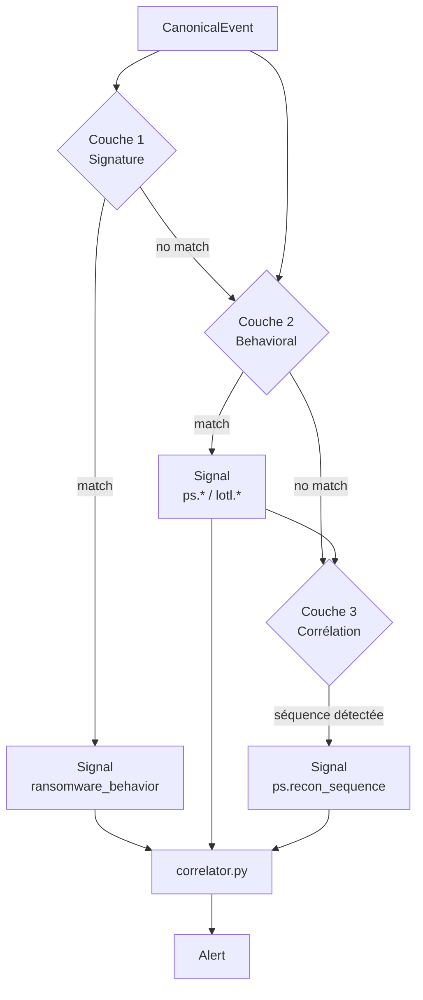

# Trois couches de détection

## Architecture décisionnelle



!!! note
    En pratique, les couches ne sont pas exclusives — un événement peut produire des Signals dans plusieurs couches simultanément.

---

## Couche 1 — Signature

**Module** : `ransomware_v4.py`  
**Objectif** : détecter les patterns comportementaux du ransomware sur les événements fichier et réseau  
**Coût** : O(n) — un seul parcours de la liste d'événements

### Ce qu'elle détecte

| Indicateur | Seuil | Score |
|---|---|---|
| Écriture massive de fichiers | > 20 fichiers uniques / 60s | +0.40 |
| Extension fichier suspecte | Liste d'extensions connues | +0.30 |
| Suppression VSS | `vssadmin delete shadows` etc. | +0.40 |
| Connexion C2 | IP externe depuis process actif | +0.25 |

### Pourquoi "signature" ?

Malgré son nom, cette couche n'utilise pas de hashes de fichiers — elle détecte des *patterns de comportement* connus et documentés du ransomware. L'appellation "signature" désigne ici la correspondance à des comportements dont la forme est fixe et connue (contrairement à la couche corrélation qui cherche des séquences).

---

## Couche 2 — Comportementale

**Modules** : `powershell_sigma.py` + `lotl_sigma.py`  
**Objectif** : détecter l'utilisation suspecte de binaires légitimes par pattern matching sur `CommandLine`  
**Coût** : O(n × r) où r = nombre de règles (constant ≈ 30)

### Détection PowerShell (powershell_sigma)

| Détecteur | Technique | Score |
|---|---|---|
| Obfuscation | Backtick, string concat, char cast | 0.70 |
| Download cradle | WebClient, Invoke-WebRequest | 0.75 |
| AMSI bypass | amsiInitFailed, AmsiScanBuffer | 0.85 |
| Encoded command | `-enc [base64]` | 0.65 |
| Nested scripts | PowerShell dans PowerShell | 0.60 |

### Détection LOTL (lotl_sigma)

8 règles ciblant les binaires à fort signal/bruit (cf. [Règles LOTL complètes](../detection/lotl-rules.md)).

### Spawn suspects (process tree)

La couche 2 exploite le `ProcessTree` pour détecter 32 paires parent→enfant anormales :

```
winword.exe     → powershell.exe  ✗ (macro malveillante)
wmiprvse.exe    → cmd.exe         ✗ (WMI lateral)
svchost.exe     → powershell.exe  ✗ (service compromise)
```

---

## Couche 3 — Corrélation

**Module** : `powershell_sigma.correlate_recon_sequence()`  
**Objectif** : détecter des séquences d'événements dans une fenêtre temporelle  
**Coût** : O(n) — groupement par `process_key` puis scan des timestamps

### Séquence détectée en v2

```
[recon_identity signal]  whoami / hostname / Get-LocalUser
    ↓  < 5 minutes, même process_key
[recon_enum signal]      net user / ipconfig / systeminfo
    → Signal corrélé score=0.80, T1087 (Account Discovery)
```

### Fenêtre temporelle

```python
RECON_WINDOW_SECONDS = 300  # 5 minutes
```

Deux Signals du même `process_key` séparés de plus de 5 minutes ne déclenchent pas la corrélation.

### Extension prévue (v3)

La corrélation par kill chain MITRE sera ajoutée en v3 :

```
T1059 (Execution) suivi de
T1053.005 (Persistence) suivi de
T1047 (Lateral Movement)
    → fenêtre 10 minutes, même host
    → Alert: "Kill chain détectée — 3 tactiques en 10 minutes"
```
