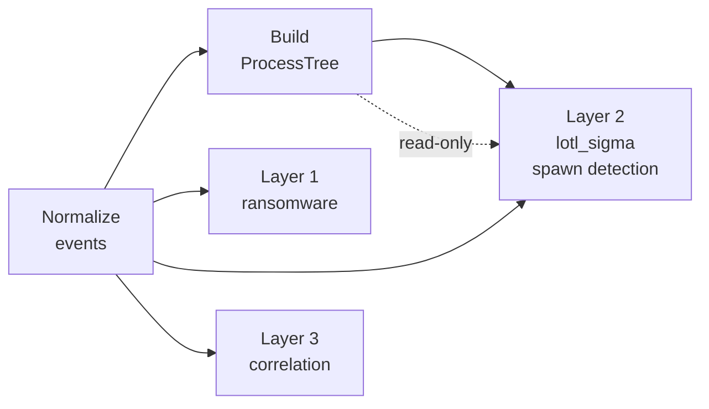

# Vue d'ensemble de l'architecture v2

## Principes hérités de v1

Les quatre invariants de v1 sont maintenus et renforcés :

1. **Immuabilité** — `CanonicalEvent` reste `frozen=True`
2. **Déterminisme** — `signal_id` SHA-256
3. **Isolation des modules** — chaque couche est wrappée en `try/except`
4. **Séparation Signals/Alerts** — inchangée

## Nouveaux principes v2

**5. Tolérance aux pannes par couche**  
En v1, une exception dans un module arrêtait le pipeline. En v2, chaque couche de détection est wrappée. La couche défaillante est loguée et ignorée, les autres continuent.

**6. Process tree read-only après construction**  
Le `ProcessTree` est construit une fois avant les détecteurs, puis passé en lecture seule. Aucun module de détection ne peut le modifier.

**7. Parseur syslog pur (sans I/O externe)**  
`syslog_parser.py` n'effectue aucun appel réseau, aucun subprocess, aucun `eval`. C'est une transformation pure : `str → Dict[str, Any]`.

## Les trois couches de détection

```
┌─────────────────────────────────────────────────────────────┐
│  Couche 1 — SIGNATURE                                       │
│  ransomware_v4                                              │
│  Détection par hashes, patterns comportementaux connus      │
│  Complexité : O(n), rapide                                  │
├─────────────────────────────────────────────────────────────┤
│  Couche 2 — COMPORTEMENTALE                                 │
│  powershell_sigma + lotl_sigma (+ process tree)             │
│  Détection par patterns de CommandLine et spawn suspects    │
│  Complexité : O(n × règles), linéaire                       │
├─────────────────────────────────────────────────────────────┤
│  Couche 3 — CORRÉLATION                                     │
│  correlate_recon_sequence                                   │
│  Détection par chaînes d'événements sur fenêtre temporelle  │
│  Complexité : O(n), groupement par process_key              │
└─────────────────────────────────────────────────────────────┘
```

### Pourquoi cet ordre ?

La couche 1 (signature) est délibérément exécutée en premier car elle est la moins coûteuse et la plus déterministe. En production, elle pourrait short-circuit le reste du pipeline si un IOC connu est trouvé.

La couche 3 (corrélation) doit s'exécuter en dernier car elle consomme les Signals produits par la couche 2 (`ps_signals`) pour détecter les séquences.

## Process Tree — positionnement architectural



Le `ProcessTree` est construit **une seule fois** après la normalisation, puis transmis aux modules qui en ont besoin (actuellement uniquement `lotl_sigma`). Cette architecture évite de reconstruire l'arbre à chaque module et garantit que tous les modules voient le même état.

## Taxonomie MITRE ATT&CK dans les Signals

Chaque Signal v2 porte désormais :

```python
signal.mitre_tactic    # ex: "Lateral Movement"
signal.mitre_technique # ex: "T1047"
```

Cela permet une **corrélation par tactique** : si plusieurs Signals successifs sur un même host couvrent `Execution → Persistence → Lateral Movement`, on peut reconstituer une kill chain sans règle de corrélation spécifique.

!!! info "Corrélation par kill chain — v3 roadmap"
    La corrélation automatique des séquences MITRE (ex : détecter T1059 suivi de T1053.005 suivi de T1047 dans une fenêtre de 10 minutes) est prévue pour v3. Les données sont déjà disponibles dans les Signals v2.
