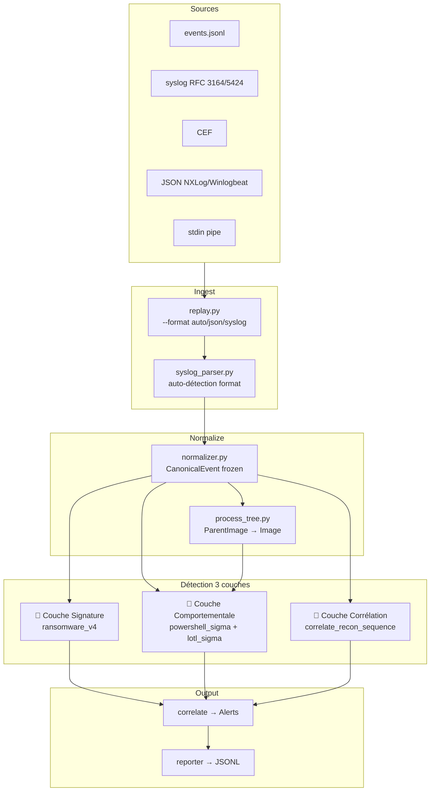

# Mini-SIEM v2 — Documentation

<div style="background: linear-gradient(135deg, #0d2137 0%, #0a3d62 50%, #1e5f74 100%); padding: 2rem; border-radius: 12px; margin-bottom: 2rem;">
<h2 style="color: #00d2d3; margin: 0 0 0.5rem 0;">🛡️ Mini-SIEM v2</h2>
<p style="color: #a8d8ea; margin: 0;">Syslog multi-format · Process Tree · LOTL Detection · MITRE ATT&CK</p>
</div>

## Présentation

Mini-SIEM v2 est une évolution majeure de v1. Les apports essentiels :

| Fonctionnalité | v1 | v2 |
|---|---|---|
| Format d'entrée | JSONL maison uniquement | JSONL + RFC 3164 + RFC 5424 + CEF + JSON-in-syslog |
| Process Tree | ✗ | ✓ Index parent→enfant, 32 paires spawn suspects |
| Couches de détection | 2 (behavioral + correlation) | **3** (signature + behavioral + correlation) |
| MITRE ATT&CK tagging | ✗ | ✓ Tactique + Technique sur chaque Signal |
| Règles LOTL | ✗ | ✓ 8 règles (vssadmin, wmic, mshta, certutil, rundll32, schtasks, cron, regsvr32) |
| Spawn suspect detection | ✗ | ✓ Office, browsers, WMI, loaders → shells |
| EventID scheduling tasks | ✗ | ✓ 4698/4699/4702 |
| Isolation des erreurs | Propagation | ✓ try/except par couche |
| Audit policy activation | Manuel | ✓ Automatique dans run_siem.bat |

## Architecture en un coup d'œil



## Structure du projet v2

```
SIEM/
├── events.jsonl
├── events_large.jsonl
├── syslog/                        # Nouveau — répertoire pour logs syslog
│   └── security.log               # Fichier syslog à placer ici
├── run_siem.bat                   # Mise à jour : auditpol + mode syslog
├── src/
│   ├── core/
│   │   ├── schemas.py             # Signal enrichi mitre_tactic/mitre_technique
│   │   ├── ids.py
│   │   └── time.py
│   ├── normalize/
│   │   ├── normalizer.py
│   │   └── process_tree.py        # Nouveau — index process parent→enfant
│   ├── detect/
│   │   ├── engine.py              # Mis à jour — 3 couches + process tree
│   │   └── modules/
│   │       ├── ransomware_core.py
│   │       ├── ransomware_v4.py
│   │       ├── powershell_sigma.py
│   │       ├── powershell_suspicious.yaml
│   │       └── lotl_sigma.py      # Nouveau — 8 règles LOTL
│   ├── correlate/
│   │   └── correlator.py
│   ├── ingest/
│   │   ├── replay.py              # Mis à jour — --format flag + stdin
│   │   └── syslog_parser.py       # Nouveau — parseur multi-format
│   └── output/
│       └── reporter.py
```

## Lancement rapide v2

```bat
# JSON events (compatible v1)
run_siem.bat large

# Syslog file
run_siem.bat syslog

# Streaming stdin (NXLog, rsyslog)
tail -f /var/log/syslog | python -m ingest.replay --format syslog --input - --out-dir out/live

# Auto-detect (fichier mixte)
python -m ingest.replay --format auto --input mixed.log --out-dir out/
```
