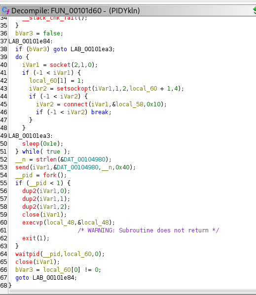
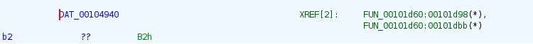
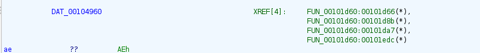

# Malware Reverse Analysis — Reverse Shell Linux (ELF)

## Overview

This repository contains a full static reverse engineering analysis of a Linux ELF malware implementing a persistent reverse shell. The objective was to identify its behavior, communication method, encryption logic, and Command & Control (C2) configuration while maintaining safe disclosure practices.

All sensitive infrastructure details have been intentionally sanitized in this public version.

---

## Sample Classification

| Field | Value |
|------|-------|
| Type | Linux ELF 64-bit |
| Architecture | x86_64 |
| Malware Category | Reverse Shell / Backdoor |
| Persistence | Retry loop every 30 seconds |
| C2 Protocol | TCP |
| Encryption | Custom XOR stream cipher |

---

## Key Findings

### Reverse Shell Behavior
The malware establishes a TCP connection to a remote server and redirects standard input/output streams to spawn an interactive shell. The execution flow includes:

- socket() initialization
- connect() to C2
- send() of initial payload
- fork() process creation
- dup2() IO redirection
- execvp() shell execution



---

## C2 Initialization Logic

The sockaddr structure is manually constructed before connection:

- sa_family = AF_INET
- Port constructed from two encoded bytes
- IP converted using inet_pton()


The full IP address has been redacted for safety:

```
C2 IP   : 39.186.150.xxx
Port    : 25086
```

---

## Encrypted Data Storage (.rodata)

The malware does not store its C2 configuration in clear text. Instead, it stores encrypted blobs inside the .rodata section.

### Encrypted IP Blob




### Encrypted Shell Path




---

## Custom Decryption Algorithm

The malware uses a custom XOR stream cipher implemented in the function FUN_001014b0. The key is generated dynamically using a deterministic algorithm based on a seed value and loop index.

Notable characteristics:

- Initial seed: 0x23
- Multiplicative key evolution
- XOR operation per byte
- Character filtering to avoid null bytes and printable characters


---

## Decryption Script

A Python script was created to replicate the malware's decryption logic and extract the concealed configuration.

File: `decrypt_c2.py`

Output (sanitized):


Example output:

```
IP      : 39.186.150.xxx
Shell   : /bin/bash
Payload : VERSION_STRIN
```

Original encrypted values have been removed from this public version to prevent reconstruction of private C2 infrastructure.

---

## Conclusion

This malware demonstrates a lightweight but effective reverse shell implementation with basic obfuscation mechanisms to conceal its network configuration. The encryption is deterministic and reversible, making static analysis sufficient to extract Indicators of Compromise when combined with careful reverse engineering.

All analysis was conducted in a controlled environment using Ghidra and a virtualized Linux system.

---

## Safety Notice

This repository is provided strictly for educational and defensive research purposes. Any real C2 infrastructure details have been intentionally redacted to avoid malicious reuse.

Never execute unknown binaries outside a secured and isolated lab environment.

---

## Tools Used

- Ghidra 11.4.2
- Python 3.x
- Kali Linux (virtualized)
- Windows Host (documentation only)

---

## Author

Analyst: REDACTED

Role: Malware Reverse Engineering / SOC-oriented Analysis

Project Context: Cybersecurity Portfolio

---

## References

- MITRE ATT&CK T1059 – Command and Scripting Interpreter
- MITRE ATT&CK T1105 – Ingress Tool Transfer
- Linux Reverse Shell Techniques

