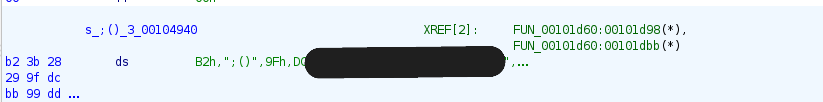
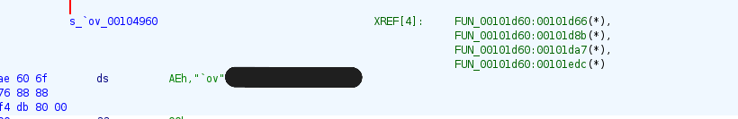

<div class="nav-bar">
  <h1>PIDYkln – Linux Reverse Shell (ELF) Analysis</h1>
</div>

## Project Overview

This folder contains a complete static analysis of a **Linux ELF 64-bit reverse shell** sample named `PIDYkln`.

Goals of the analysis:

- Understand the full reverse shell behavior
- Recover the hidden C2 configuration (IP + port) from encrypted data
- Reverse the custom decryption routine
- Produce a clean technical report, YARA rules, and a Python helper script

Everything here is part of my malware analysis / blue team portfolio.

---

## Repository Layout (for this sample)

- `readme_malware_reverse_analysis_report.md` – detailed written report of the analysis  
- `decrypt_c2.py` – Python implementation of the malware’s decryption routine  
- `screenshots/` – Ghidra and console screenshots used in the report  
- `yara/` – YARA rules for this sample and its family

---

## 1. Reverse Shell Behavior

The binary behaves as a reverse shell client:

- creates a TCP socket
- configures a `sockaddr` structure with AF_INET, C2 IP and port
- repeatedly tries to connect to the C2
- sends an initial identification payload
- forks a child process
- redirects stdin / stdout / stderr to the socket using `dup2`
- executes `/bin/bash` using `execvp`

```text
socket()
setsockopt()
connect()
send()
fork()
dup2()
execvp("/bin/bash")
sleep(30)
loop...
```

Screenshot (Ghidra decompilation of the loop):


---

## 2. C2 Initialization (IP + Port)

Before calling `connect()`, the malware builds a `sockaddr`:

- `sa_family = AF_INET`
- port reconstructed from two bytes in `sa_data` (`'a'` and `-2`) → `25086/TCP`
- IP string stored encrypted, decrypted at runtime, then passed to `inet_pton()`

Sanitized C2:

```text
IP   : 39.186.150.xxx
Port : 25086/TCP
```

Screenshot (sockaddr construction):


---

## 3. Encrypted Data in .rodata

The C2 IP, shell path and an identification payload are **not** stored in clear text.  
They appear as encrypted blobs in `.rodata`, referenced as `DAT_00104940`, `DAT_00104960`, etc.

Screenshots:




---

## 4. Custom Decryption Function

A custom XOR-based stream cipher is used to decrypt these blobs.  
The function:

- uses a fixed seed `0x23`
- evolves the key with a multiplicative pattern
- avoids NULL, LF and printable ASCII when generating key bytes
- XORs each byte of the buffer with the generated key

Screenshot (Ghidra decompilation):


---

## 5. Python Decryption Script

File: `decrypt_c2.py`

This script reimplements the decryption logic and was used to recover the C2 configuration from the encrypted blobs.

Screenshot (sanitized output):


Example (redacted):

```text
IP      : 39.186.150.xxx
Shell   : /bin/bash
Payload : VERSION_STRIN...
```

The original encrypted bytes and full IP are intentionally not exposed publicly.

---

## 6. YARA Rules

Folder: `yara/`

- `yara/dsq_exact_sample.yar`  
  Exact detection rule for this specific PIDYkln sample (ELF reverse shell).

- `yara/dsq_family.yar`  
  More generic rule targeting the same family / behavior (ELF, reverse shell, similar API usage and structure).

These rules are a starting point for detection engineering and can be refined for real environments.

---

## 7. Full Report

For a full narrative of the analysis (step-by-step, with more details):

- See: `readme_malware_reverse_analysis_report.md`

This markdown file is the long-form write-up that can be used as a SOC / malware analysis report.
