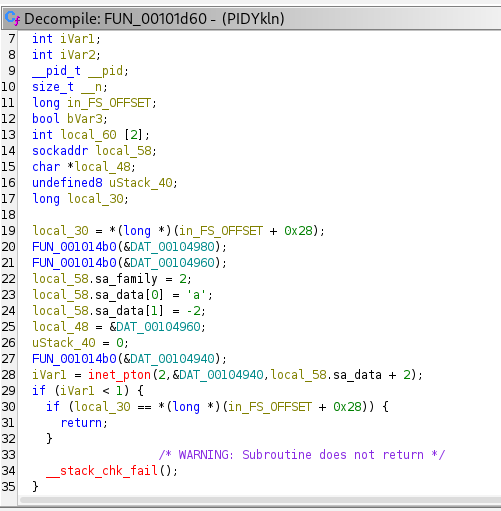
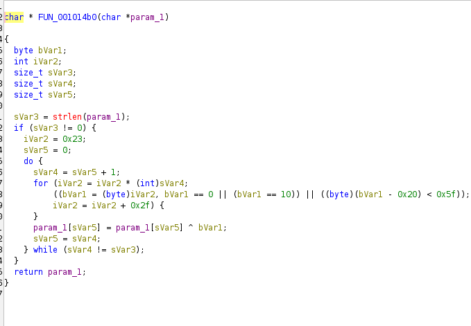
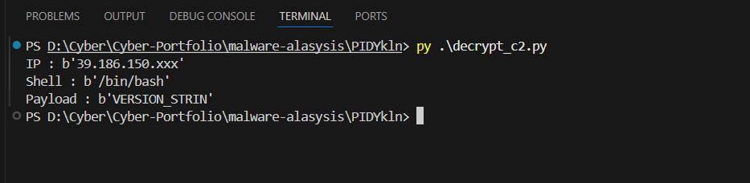

<div class="nav-bar">
  <h1>PIDYkln – Analyse d’un Reverse Shell Linux (ELF)</h1>
</div>

## Présentation du projet

Ce dossier contient une analyse statique complète d’un échantillon **Linux ELF 64-bit reverse shell** nommé `PIDYkln`.

Objectifs de l’analyse :

- Comprendre le comportement complet du reverse shell
- Récupérer la configuration C2 cachée (IP + port) à partir de données chiffrées
- Reverse l’algorithme de déchiffrement personnalisé
- Produire un rapport technique propre, des règles YARA, et un script Python d’aide

Tout le contenu fait partie de mon portfolio d’analyse malware / blue team.

---

## Structure du dépôt (pour cet échantillon)

- `readme_malware_reverse_analysis_report.md` – rapport détaillé de l’analyse  
- `decrypt_c2.py` – implémentation Python de la routine de déchiffrement du malware  
- `screenshots/` – captures Ghidra et console utilisées dans le rapport  
- `yara/` – règles YARA pour cet échantillon et sa famille

---

## 1. Comportement du reverse shell

Le binaire se comporte comme un client reverse shell :

- crée une socket TCP
- configure une structure `sockaddr` avec AF_INET, l’IP C2 et le port
- tente de se connecter au C2 en boucle
- envoie un payload d’identification initial
- fork un processus enfant
- redirige stdin / stdout / stderr vers la socket via `dup2`
- exécute `/bin/bash` via `execvp`

```text
socket()
setsockopt()
connect()
send()
fork()
dup2()
execvp("/bin/bash")
sleep(30)
loop...
```

Capture (décompilation Ghidra de la boucle) :


---

## 2. Initialisation du C2 (IP + Port)

Avant d’appeler `connect()`, le malware construit un `sockaddr` :

- `sa_family = AF_INET`
- port reconstruit à partir de deux octets dans `sa_data` (`'a'` et `-2`) → `25086/TCP`
- chaîne IP stockée chiffrée, déchiffrée à l’exécution, puis passée à `inet_pton()`

C2 neutralisé :

```text
IP   : 39.186.150.xxx
Port : 25086/TCP
```

Capture (construction de sockaddr) :



---

## 3. Données chiffrées dans .rodata

L’IP C2, le chemin du shell et un payload d’identification ne sont **pas** stockés en clair.  
Ils apparaissent sous forme de blobs chiffrés dans `.rodata`, référencés comme `DAT_00104940`, `DAT_00104960`, etc.

Captures :


---

## 4. Fonction de déchiffrement personnalisée

Un chiffrement par flux XOR personnalisé est utilisé pour déchiffrer ces blobs.  
La fonction :

- utilise une seed fixe `0x23`
- fait évoluer la clé via un schéma multiplicatif
- évite NULL, LF et l’ASCII imprimable lors de la génération des octets de clé
- applique un XOR octet par octet entre le buffer et la clé générée

Capture (décompilation Ghidra) :



---

## 5. Script Python de déchiffrement

Fichier : `decrypt_c2.py`

Ce script réimplémente la logique de déchiffrement et a servi à récupérer la configuration C2 depuis les blobs chiffrés.

Capture (sortie neutralisée) :



Exemple (neutralisé) :

```text
IP      : 39.186.150.xxx
Shell   : /bin/bash
Payload : VERSION_STRIN...
```

Les octets chiffrés d’origine et l’IP complète ne sont volontairement pas exposés publiquement.

---

## 6. Règles YARA

Dossier : `yara/`

- `yara/dsq_exact_sample.yar`  
  Règle de détection exacte pour cet échantillon PIDYkln (ELF reverse shell).

- `yara/dsq_family.yar`  
  Règle plus générique visant la même famille / le même comportement (ELF, reverse shell, usage API et structure similaires).

Ces règles sont un point de départ pour du detection engineering et peuvent être raffinées pour des environnements réels.

---

## 7. Rapport complet

Pour une version narrative complète de l’analyse (pas à pas, plus détaillée) :

- Voir : `readme_malware_reverse_analysis_report.md`

Ce fichier markdown est le write-up long format, utilisable comme rapport SOC / analyse malware.
